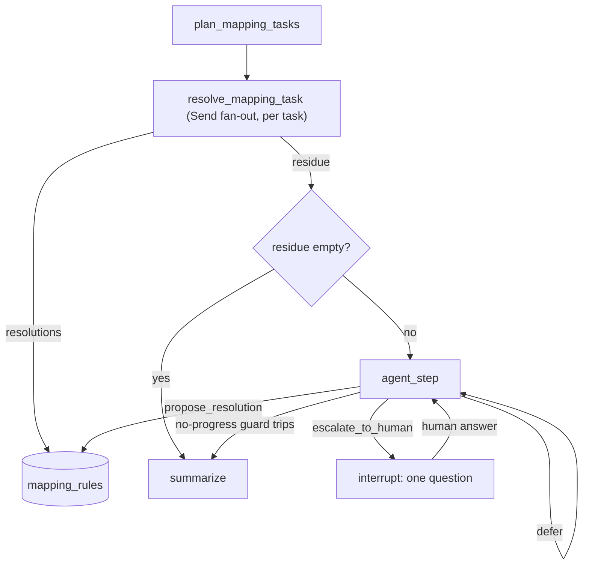

# Discovery + Mapping on LangGraph — Design Notes, Bug History, and the Scalability/Memory Opinion

This file is two things at once, deliberately:

1. It's the `README.md` that `config.py`, `graph.py`, `mapping.py`, and `store.py`
   already point to in their own comments (search this repo for `README.md` —
   every hit is a promise this file redeems). Those promises are: explain why
   the `Send`-based fan-out scales past 3 content types, and explain why the
   `mapping_rules` cache and LangGraph's checkpointer are not the same
   mechanism wearing two names. **That write-up was an explicit, still-open
   requirement of the original task spec** — it's not new scope.
2. It's the grounding document requested when pipeline work paused for the
   review presentation: a candid record of *why and how errors were made* so
   far, what this project is actually for, and the process rules meant to
   make the upcoming ground-up `mapping.py` rewrite faster and less error-prone.

Read this before touching `mapping.py` or `discovery.py` again. If a decision
recorded here needs to change, change it here first, then the code.

---

## 1. The bigger picture: the real problem, the four-way comparison, and why agents at all

The other sections are about *this* codebase. This one is about why it exists
at all — the parts that got compressed into "tutorial-scale LangGraph eval"
too quickly and are worth spelling out properly.

### 1a. The actual problem, not the toy version of it

Most organizations of any size end up running more than one content system —
different teams, different eras, different acquisitions — and those systems
are almost never migrated into one another. (This isn't a manufactured
premise: ~61% of organizations report running multiple CMS platforms
side by side, the statistic this project's own review presentation opens
with.) The result is silos that hold *related* content — the same product,
the same certification, the same policy — described in incompatible shapes,
with no durable record of how a field in one relates to a field in the
other. Two people looking at WordPress and Strapi side by side can often
tell the correspondence is there; nothing in either system records it.

Full migration is the obvious "fix," and it's usually the wrong one in
practice — expensive, risky, and it destroys the reason the two systems
diverged in the first place (different teams need different authoring
workflows; WordPress's editorial/blog-post model and Strapi's structured,
relational catalog model aren't accidents, they're each doing something the
other is worse at). The real question this project is a small, honest
attempt to answer is: **if migration isn't the answer, what actually is?**
The bet being tested here is *bridging the silos in place* — building a
durable, queryable map of "this field/value/mention over here corresponds to
that one over there," discovered once and remembered, rather than either
merging the systems or re-deriving the correspondence by hand every time
someone needs it.

WordPress and Strapi, as configured in this repo, are a deliberately small
but real stand-in for that general shape of problem, not an arbitrary choice:

- They're **structurally different enough to force genuine reconciliation
  work**: WordPress's model is a flat post + free-form `meta` bag; Strapi's
  is relational collections (`Product`/`Standard`/`Certification`) with
  real many-to-many relations. A trivial 1:1 field-name copy wouldn't work
  even in principle — which is exactly the property needed to test whether
  an agentic approach earns its keep over a naive script.
- They're **both self-describing over HTTP** (WordPress's OPTIONS schema,
  Strapi's content-type-builder/Document Service schemas) — which is what
  makes Discovery a real "inspect the system and derive structure"
  step instead of a hardcoded assumption, and is a large part of why this
  pair of systems was usable for a schema-agnostic build at all (§11 rule 2
  depends entirely on both systems exposing this).
- The seed data was built to contain **all three difficulty tiers on
  purpose**: a deterministic case that only *looks* ambiguous until checked
  (`related_product_ids` vs. `legacyId`), a genuinely undecidable free-text
  case with an honest chance of "no match" (`meta.slug` = `"BX54-FL-02"`),
  and body-text mentions of real entity names. None of that is incidental —
  it's what makes the Discovery/Mapping boundary and the escalation ladder
  (§3, §12) testable at all, rather than trivially true.

### 1b. Why an agent pipeline, not a static mapping table or an ETL script

A one-time mapping table or a hand-written ETL script would work for the
cases that are *actually* deterministic once you look — `related_product_ids`
↔ `legacyId` only needed checking once, and could be hardcoded forever
after. But the free-text case (`meta.slug`) and the body-scan case (a blog
post mentioning a product or standard by name) are not that: they're
genuinely ambiguous on first sight, admit multiple defensible readings, and
sometimes the honest answer really is "no match, escalate to a human." A
static script can't decide those; it can only get them wrong silently or
require someone to have already solved the general case by hand. That's the
actual justification for putting an LLM anywhere in this pipeline at all —
not "agents are the trendy way to do integration work," but "some fraction
of this specific reconciliation problem requires judgment a fixed rule
can't express, and that fraction needs to be identified honestly rather than
faked as deterministic or skipped." The Discovery/Mapping boundary (§3) and
the escalation ladder (§12) are both, underneath, mechanisms for keeping
that fraction as small as it honestly is — deterministic wherever a
deterministic check actually suffices, agentic only where it doesn't, human
only where even that fails — rather than routing everything through an LLM
by default or hiding the hard cases behind confident-sounding heuristics.

### 1c. Four frameworks, one fixed problem

This LangGraph build is one of **four** planned implementations of this
*exact same* Discovery + Mapping problem, against the *same* live
WordPress/Strapi seed data — the other three are LlamaIndex Workflows,
OpenAI Agents SDK, and CrewAI Flows, each built separately, in separate
branches/chats. That's a deliberate experimental control, not four unrelated
side projects: holding the problem fixed and varying only the framework is
what makes the comparison mean anything. If each framework instead got a
problem shaped to flatter its own strengths, the "evaluation" would just be
four different demos, not a comparison.

What's actually being compared, concretely, is how naturally each
framework's core primitives fit *this* problem's real shape — the four
questions any of the four frameworks has to answer one way or another,
independent of which one it is:

- a **state model** that has to hold two independently-discovered schemas
  plus an accumulating record of resolutions, correctly combined even when
  several branches write to it in parallel;
- **control flow** that has to branch on data, not just follow a fixed
  sequence — whether a field needs Mapping at all, and how many independent
  field/body-scan tasks exist, isn't known until Discovery has run;
- **dynamically-sized fan-out** over that unknown number of independent
  tasks — the workload's shape is only known at run time, not build time;
- and **memory that has to survive across separate runs**, keyed by content
  identity rather than by which run asked — a different requirement than
  most single-session agent-framework demos are built to showcase.

Each of the four frameworks will answer these with a different set of
primitives and different tradeoffs; that's the actual substance of the
comparison. This document works through LangGraph's specific answers in
§9, once the pipeline itself has been described — how *this* framework
handles the four questions is deliberately kept out of this section, since
the questions themselves are the framework-agnostic part of the picture and
belong here, while any one framework's answer to them doesn't. The
comparison across all four, once complete, should be legible as "which of
these four sets of answers fits this specific, real shape of problem best,"
not "which framework produced a working demo" (all four should be capable
of that).

### 1d. The more abstract point underneath all of this

Zoomed out one more level, the Discovery/Mapping split (§3) isn't really
specific to WordPress/Strapi at all — it's a general claim about
integration work: **a large fraction of "how does system A relate to system
B" work is answerable from structural signals on one side alone (is this
field typed, described, related to something else?), and only a smaller,
genuinely irreducible remainder requires holding both systems in view at
once and exercising judgment.** Getting that split right — not doing
cross-system reasoning too early (the original spec's own mistake, corrected
before this build started) and not doing single-system reasoning too late
(deferring everything to an LLM by default) — is the transferable idea this
project is really testing, independent of which of the four frameworks ends
up expressing it best. The LangGraph-specific question (§9) and the
framework comparison (§1c) are both, underneath, instruments for examining
that one question from different angles.

## 2. What this project actually is (and isn't)

This is a **tutorial-scale evaluation of LangGraph's core concepts** —
graph/state, nodes, conditional edges, `Send` fan-out, checkpointing — applied
to one realistic, non-trivial problem: reconciling WordPress and Strapi
content without migrating either system. The same problem is being (or will
be) built separately in LlamaIndex Workflows, OpenAI Agents SDK, and CrewAI
Flows, in other branches/chats, for a direct framework comparison.

Two consequences follow from that framing, and both have been violated at
least once already (see §6):

- **It is not production entity-resolution software.** Correctness only
  matters insofar as the problem needs to stay *real enough* to genuinely
  exercise the framework's primitives. A toy-simplified version (e.g.
  hardcoded field names, single-instance-only aggregation) wouldn't stress
  LangGraph's state/conditional-routing/memory model in any way that
  transfers to the other three frameworks' evaluations — it would just be
  measuring how fast each framework can run a fake problem.
- **It must still be conceptually honest.** The Discovery/Mapping boundary,
  the escalation ladder, and the memory model all have to work the way a real
  system would need them to, even at tutorial scale — because the scalability
  and memory opinions this project is required to produce (§9) are only
  worth anything if they're grounded in a design that would actually hold up
  if scaled, not one that happens to work because the demo data is small.

## 3. The Discovery / Mapping boundary (settled, do not re-derive a weaker version)

- **Discovery** = single-schema profiling. It may inspect either system, but
  never compares them, and never asks "does X correspond to Y." It flags a
  field `ambiguous` on purely structural, single-schema grounds: no
  description **and** no relation participation. It is never allowed to flag
  something ambiguous *because* "I couldn't find a match in the other
  system" — that check needs both schemas at once, which is Mapping's job.
- **Mapping** = the only agent ever allowed to hold both systems' schemas and
  data simultaneously. All cross-system reasoning happens here, including
  correcting Discovery's own mistakes. Discovery is a cheap, fallible first
  pass; Mapping is the authority.

This is why `wp_ambiguous_fields`/`strapi_ambiguous_fields` (Discovery's
output) are advisory hints Mapping consults, not gates Mapping obeys: Mapping
runs its own deterministic checks against **every** schema-declared field
(see `plan_mapping_tasks`'s field-level loop), regardless of whether Discovery
flagged it, precisely so Discovery being wrong about a field doesn't hide it
from Mapping.

**One axis, not two.** The rule above is about *which schemas an agent is
allowed to hold at once* — it says nothing about whether Discovery's
single-schema step has to be deterministic. Those turned out to be
independent: "Discovery is single-schema" does not logically force "Discovery
is boolean-only, no LLM." That stronger claim was a separate, unexamined
scope choice this project made, not a consequence of the boundary rule. §4
covers the research that surfaced this and the (not-yet-implemented) change
it justifies.

## 4. Discovery's semantic-enrichment role (research-grounded, target design, not yet implemented)

The original spec planned Discovery to be agentic; the current `discovery.py`
is 100% deterministic (`_ambiguous()` is a pure boolean rule, no LLM call
anywhere). The user asked for real, cited research — not a re-derivation from
memory — on whether that determinism decision still holds, with
"schema-awareness" as the central theme. It does hold, with one real
correction.

**What the research confirmed as already right:**

- Deterministic schema **extraction/introspection** is universal practice,
  not a shortcut this project took. The MCP reference SQLite/Postgres
  servers, LangChain's `InfoSQLDatabaseTool`/`sql_db_schema` (built on
  `sqlalchemy.inspect`/`MetaData.reflect`), PostgREST, and Hasura all
  introspect structure with plain code, never an LLM. Discovery's OPTIONS/
  content-type-builder parsing is exactly this pattern and is unaffected.
- Cross-system schema matching is validated as a *distinctly harder*,
  dedicated LLM task — not something string-similarity or naive matching
  handles. "Schema Matching with Large Language Models" (arXiv:2407.11852)
  found naive similarity baselines scoring AUC 0.04–0.14 on this exact
  problem class; LLMATCH (arXiv:2507.10897) and BoostER (arXiv:2403.06434,
  which restricts LLM use to a selected ambiguous subset of an entity-
  resolution task) reinforce the same split. This strongly reconfirms §3:
  cross-system reasoning is real, hard, and belongs to Mapping alone.
- Cheap-deterministic-first, LLM-fallback-only-for-genuine-ambiguity is a
  recognized architecture pattern (Anthropic's "Building Effective Agents";
  FrugalGPT, arXiv:2305.05176, showing cascades cutting LLM cost up to 98%
  without giving up cheap-tier accuracy) — the exact phrase "confidence-gated
  fallback" wasn't found verbatim anywhere, but the pattern itself is real
  and well-attested.

**What the research surfaced as a real gap:** a distinct, *single-schema-
only* "semantic enrichment" step exists in practice — using an LLM to infer a
field's likely meaning from its own name and its own sample values, with no
cross-schema comparison at all. Snowflake's Semantic View Autopilot / Cortex
Analyst, dbt's Semantic Layer, Vanna.ai's "Context Enrichers," and two papers
doing this at column level — TACO (arXiv:2606.21685: abbreviation expansion →
description generation → description revision) and zero-shot column-header
classification (arXiv:2403.00884) — all do exactly this. Discovery currently
does none of it: `_ambiguous()` only ever emits a boolean, never a semantic
characterization of *why* a field looks the way it does.

**Decision: adopt this, staying strictly inside the §3 boundary.** Discovery
gains a second, LLM-backed step with three hard constraints:

1. **Stays single-schema.** The enrichment call is given only that field's
   own name, its own description (if any), and a sample of that field's own
   observed values across records of the *same* system. It is never given
   anything from the other system, and it is never asked "does this
   correspond to X" — that question stays Mapping's alone, unconditionally.
2. **Stays cost-gated.** Per the cheap-first pattern above, the LLM only runs
   for fields the existing free deterministic `_ambiguous()` check already
   flagged (no description **and** no relation) — e.g. `related_product_ids`
   and `meta.slug`, not every field. The boolean check keeps its current job
   as an always-run, free gate; the LLM step is strictly downstream of it,
   not a replacement for it.
3. **Produces evidence, not a verdict.** The output is a short semantic
   gloss (free text), e.g. for `meta.slug` = `"BX54-FL-02"`: *"name suggests
   a URL-style slug, but observed values across posts are uppercase
   alphanumeric codes with hyphens — inconsistent with a URL/post-name
   pattern, more consistent with a product/part code"* — generated only from
   WordPress's own data. This gloss feeds into the residue-tier agent's
   context (§12) as additional evidence when it reasons over this field;
   Mapping still makes the actual cross-system call, not Discovery.

**Caching implication (extends §9b, doesn't complicate it):** this is a new
LLM call site, so it needs the same zero-calls-on-cache-hit guarantee as
everything else. It doesn't belong inside `mapping_rules` — a field gloss has
no `target_system`/`target_ref`, it isn't a resolution — so it needs its own
small table (working name: `field_semantic_notes`, keyed by source system +
content type + field name, sitting beside `mapping_rules`, not inside it).
This is a second instance of the same §9b argument, not a complication of
it: LangGraph's checkpointer still wouldn't naturally subsume this either,
for the same reason it doesn't subsume `mapping_rules` — it's business-level,
content-addressed memory, not thread-scoped run state.

**Not yet implemented.** This is a documented decision, not a code change —
per the user's current priority, the README is being made solid first;
implementation (in `discovery.py`, the new cache table, and how `mapping.py`
consumes the gloss) is deferred and will follow §11's one-function-at-a-time,
approved-before-written process when it starts. One stale claim to fix at
that point: `llm_client.py`'s docstring currently says "Discovery never calls
it," which will no longer be true.

## 5. Current implementation status

Committed to git already: `wp_client.py`, `strapi_client.py`, `vocab.py`,
`config.py`, `llm_client.py`, `store.py`. These were the target of the
*first* round of fixes (see §10) and held up against that round — but
`vocab.py` is not actually issue-free: it has one confirmed bug (Bug 5, §6),
found later and not part of that first round, which is exactly the kind of
gap "already committed" doesn't guarantee against (§10).

**Not yet committed — still in flux**: `discovery.py`, `mapping.py`,
`graph.py`, `run.py`. `mapping.py` in particular is the subject of the
planned ground-up, step-by-step rewrite (§10) and currently contains five
of the six confirmed bugs (§6, all but Bug 5) plus two
agreed-but-unimplemented changes (§7).

The pipeline has been run end-to-end on live data and verified working for
the two required Mapping sub-cases (WP post 14's `related_product_ids`
structured match; WP post 19's `meta.slug` free-text escalation) and the
run-twice/zero-new-LLM-calls cache proof — **but "verified working on the
demo data" is exactly the property that let most of the bugs below stay
hidden** (§10 explains why, for all six).

**Escalation redesign, in progress (§12 rewritten; this is the current
front of work).** The target design changed from a linear
deterministic→LLM→human cascade to an agentic one: tier 1 stays exhaustive
and automatic, but everything it can't resolve is now handed, as data, to a
single reasoning agent with full visibility over the whole unresolved pool
— see §12 for the full rationale and shape. The first step of that rewrite
is done and verified: `mapping.py`'s old isolated-LLM-call site
(`_record_llm_judgment`, Bug 6's mechanism) has been removed entirely and
replaced with `_resolve_or_defer`, which never calls an LLM — it either
resolves for free (cache hit, or zero candidates → `no_match_confirmed`) or
returns the ambiguous case as a `residue` item for the not-yet-built agent
tier to consume. `resolve_mapping_task` now returns
`{"resolutions": [...], "residue": [...]}`, and `PipelineState` has a new
`residue: Annotated[list[dict], operator.add]` key alongside `resolutions`,
using the same parallel-`Send`-safe reducer. Run against live data
(`python run.py`), both runs now produce **0 LLM calls**, 26 identical
resolutions, and 22 identical residue items (post 19's `meta.slug` plus
every body-scan mention across posts 14/19/21/22/23) — confirming Bug 6's
old call site is gone, not just moved, and that residue re-derives
identically across runs (it isn't cached, since nothing in the agent tier
has resolved it yet). Not yet built: the `agent_step` node itself, its
tool set, the no-progress termination guard, and the routing edge that
sends non-empty `residue` there instead of straight to `summarize` — see
§12's "Not yet implemented" subsection for the exact next steps.

## 6. Six confirmed bugs in the current `mapping.py` / `vocab.py`

**Bug 1 — tie-blindness in `_match_ints`** (`mapping.py`, `_match_ints`,
around the `if best is None or len(hits) > len(best["matched_refs"]):` line).
Strict `>` means an equally-good second candidate — e.g. a hypothetical
second Strapi integer column that also happens to contain `104, 891, 233` —
is silently discarded. No record, no ambiguity flag, no confidence penalty.
Whichever index was iterated first wins, invisibly.

**Bug 2 — single-post aggregation in `plan_mapping_tasks`** (the
`if match_by_post[post["id"]]["match"] and schema_match is None:` line).
`schema_match` is set once, from whichever post is iterated *first* that
produces a match, and is never revisited or aggregated across every post
sharing that field. This breaks "consider evidence across multiple posts"
even for the deterministic path, not just the LLM path.

**Bug 3 — partial int-list mismatches are silently absorbed, never
escalated** (`mapping.py`, `_match_ints` combined with
`_resolve_field_match`'s `if per_post["match"]:` branch). `_match_ints`
builds `hits` only from the values that *are* present in the target index —
any value in the list that isn't present is dropped before `best` is even
computed, with no record of which value(s) failed. If 2 of 3 values in an
int-list field hit, the whole field is still recorded as a successful
`value_range_match` (confidence `2/3`, `target_ref` covering only the 2
matched values) — and the 3rd, non-matching value never becomes `evidence`,
never gets a `fuzzy_candidates` list built for it, and never reaches
`_record_llm_judgment`/the LLM at all. A partially-wrong or partially-stale
value in an otherwise-valid list is invisible to the whole pipeline, not
just under-confident about it — there is currently no per-value fallback
path once the field-level aggregate finds *any* hits.

**Bug 4 — the free-text fuzzy-candidate fallback searches only descriptive-
label vocabulary, never identifier vocabulary** (`mapping.py`, the
`_fuzzy_candidates` call in the `meta.slug`-style fallback branch; `vocab.py`,
`build_entities`/`build_token_index`). Exact matching (`_match_string`/
`_match_ints`) already uses `_build_unique_indices`, which generically covers
every Strapi `unique`-flagged attribute across every content type — confirmed
directly against the real schema files: `product.sku`, `product.legacyId`,
`standard.name`, `certification.name`. But the fuzzy fallback — used exactly
when exact matching *fails* — ignores that index entirely and only searches
the same descriptive-label vocabulary built for the body-scan use case
(tokenized `mainField` values), reused verbatim, per an explicit code
comment, for a structurally different problem: matching an identifier-like
code (`meta.slug = "BX54-FL-02"`) against other codes, not against
descriptive names. The current demo "works" only because of a coincidence in
this catalog's naming — confirmed against `catalog-seed.json`: all three
BX54-family products' labels *and* SKUs happen to both contain `bx54`. A
product whose label and SKU share no word (e.g. a value like `"SW100-A2"`
against `Veridian GL100 Safety Interlock Switch` / sku `SIS-VER-SW100`) would
today silently produce zero fuzzy candidates and resolve to a confident-
looking but wrong `no_match_confirmed`, not a flagged low-confidence case.

**Bug 5 — `vocab.py`'s `_MIN_TOKEN_LEN = 4` drops real short identifiers
that exist in this project's own catalog** (`vocab.py`, `tokenize`).
Confirmed directly by running it: `tokenize("UL Listed") == ["ul", "listed"]`
— `"ul"` (2 letters) is dropped by the length cutoff, and the code's own
comment cites `"ul"` as an example of noise intentionally filtered out,
despite "UL Listed" being one of only two certifications in the real seed
catalog. Because the same filter is applied symmetrically to both the
indexed vocabulary and the value being matched against it, any WordPress
content mentioning "UL" without the word "Listed" nearby can never surface
this certification as a candidate — not a rare edge case, but a structural
blind spot against real data already seeded in this project.

**Bug 6 — every ambiguous mention is judged by the LLM in total isolation,
even when several mentions on the same post are evidence for the same
real-world fact** (`mapping.py`, `plan_mapping_tasks` / `route_mapping_tasks`
/ `_resolve_field_match` / `_resolve_body_scan`). Confirmed by running the
real body-scan logic against WP post 19's actual title + content
("Reordering the BX54 Focus Lens... reordering the replacement lens for your
BX54 engraver..."): the tokens `replacement`, `focus`, and `lens` each
independently and *unambiguously* resolve to product 891 (`BX54 Replacement
Focus Lens`, one candidate each), and `engraver` alone resolves to product
104 — all on the exact same post whose `meta.slug = "BX54-FL-02"` field is
*also* being judged, ambiguously, against all three BX54 products (104, 233,
891), as a completely separate task. `plan_mapping_tasks` builds
`field_match` and `body_scan` as independent task *kinds*, fanned out via
separate `Send()` calls; `_resolve_field_match` and `_resolve_body_scan` each
call `_record_llm_judgment` once per field, and once per body-scan token,
with no aggregation step by `post_id` before or after. The measured result
for post 19 alone: **five separate LLM calls** (`meta.slug`, plus one each
for tokens `bx54`, `replacement`, `focus`, `lens`, `engraver`) about what is
really one or two underlying real-world facts, none of which ever see each
other's evidence or candidates. The `meta.slug` judgment call never learns
that the same post's body text already resolved, near-unambiguously, to
candidate 891 — corroboration the pipeline itself already computed, in the
same run, and then discarded.

*The fix for Bug 6 — superseded plan, kept on record.* An earlier version of
this fix (aggregate every ambiguous signal for the same `post_id` into one
bundle *before* the LLM is ever called, and issue a single forced LLM
judgment per post) was drafted but never implemented, and has since been
**superseded by the agentic-residue redesign in §12**, not built as
described here. That earlier plan still forced a *fixed* aggregation unit
(one call per post) chosen by the code, not by anything reasoning about
what's actually relevant — it would have fixed post 19's specific case but
baked in the same kind of unexamined assumption Bug 2 already shows is
risky (§10). The design that actually replaced it does something more
general: instead of forcing an aggregation boundary up front, every
genuinely ambiguous case (per field, per body-scan token — the same
granularity as today) becomes a `residue` item with no LLM call attached to
it at all, and a single agent with full visibility over *all* residue items
across *all* posts decides for itself, at read time, which ones are
evidence for the same real-world fact — using tools, not a hardcoded
`post_id` grouping key. This is strictly more general than "bundle by
post": it would also connect, say, one post's `meta.slug` to a *different*
post's body mention if that's ever the actual evidence pattern, which a
fixed per-post bundle could never do.

**Bug 6's status as of this writing**: the isolated-call mechanism itself
is confirmed gone — `mapping.py`'s `_record_llm_judgment` (the function
named throughout this bug's description) has been deleted, and running the
pipeline against live data now shows **0 LLM calls** where post 19 alone
used to produce 5 (verified in §12's implementation-status subsection).
What Bug 6 originally complained about — evidence never seeing other
evidence for the same fact — is not yet demonstrated *fixed*, because the
agent tier that's supposed to do that cross-evidence reasoning doesn't
exist yet; today, all 22 ambiguous cases (including post 19's) simply sit
in `residue`, unresolved by anything. Calling Bug 6 "fixed" is only honest
once the agent tier is built and shown, against this same post-19 evidence,
to actually connect `meta.slug` to the body mentions the way the original
bug report expected.

Bugs 1–5 are real and still in the code as of this writing — none of those
five have been fixed yet; that's part of what the rewrite in §10 needs to
address. Bug 6 is the one exception, in the qualified sense described
above: its mechanism is gone, but the behavior it demanded isn't proven yet.

## 7. Change A and Change B (agreed, not yet implemented)

**Change A** (code, not yet done): WordPress's OPTIONS schema marks several
fields `readonly: true` (confirmed live via `curl`: `id`, `guid`, `link`,
`modified`, `modified_gmt`, `type`, `permalink_template`, `generated_slug`,
`class_list`). These are platform-internal/administrative fields that should
never reach Mapping's field-level checks in the first place. Plan: have
`discover_wordpress` mark such fields (e.g. `platform_internal: true` in the
structural map) and have `plan_mapping_tasks` skip them.

**Change B** (documentation only, deliberately *not* code): a schema-level
"linguistic pre-filter" — comparing field name/description similarity
between, e.g., `meta.related_product_ids` and `product.legacyId`/`sku`
(strong pair) vs. `comment_status` and `product.sku` (prunable pair) — is a
reasonable idea for cutting the O(fields × Strapi attributes) search space at
real scale, but changes nothing observable at 3 content types, so it's
recorded here rather than implemented now. **Critical exemption, non-
negotiable if this is ever built**: any field Discovery already flagged
`ambiguous` (no description, no relation) must be *exempt* from pre-filter
pruning. A low similarity score on an ambiguous field (e.g. `meta.slug`,
whose name gives essentially no honest signal either way) means "no
information," not "confidently irrelevant" — and `meta.slug` is exactly the
field that turns out to matter. This is the same "absence of evidence ≠
evidence of absence" principle the Discovery/Mapping boundary itself rests
on (§3); Change B would violate that principle if it pruned ambiguous fields
by name similarity alone.

## 8. A retracted idea, kept on record so it doesn't get re-proposed

An idea was floated to store a separate cache row for "how do I read this
value" (parsing/shape decisions, e.g. is `"SKU-104-891"` an int-list or a
string?) versus "does that reading correspond to something" (the match
decision) — motivated by worrying that `_parse_int_list`'s regex might
mis-tokenize hyphenated values. **This was tested against the actual regex**
(`_INT_TOKEN_RE = re.compile(r"[^0-9-]+")`) and disproven: hyphens are not
delimiters, so `"SKU-104-891"` and `"2024-01-15"` correctly fail int-parsing
and fall through to string matching. The idea was dropped. The real residual
risk in this area is a *field-relevance* problem (an integer field that
happens to share values with a Strapi column by coincidence, not by meaning)
— that's what Change B's pre-filter is for, not a parsing fix. Do not
re-introduce a "shape decision" cache row unless a genuine counter-example
(clean digit-only tokens on non-hyphen delimiters, e.g. an aspect ratio like
`"16,9"`) is found in real data.

## 9. Scalability & memory — the required opinion

This section is the actual deliverable the original task spec asked for:
*"surface how LangGraph's state/checkpointing model would scale against
hundreds of content types, and whether the SQLite `mapping_rules` cache is
something LangGraph's own persistence primitives would naturally subsume,
complement, or just sit beside as a separate concern."*

### 9a. Does the graph's *shape* scale past 3 content types?

Yes, and this is the one part of the design that scales for free, because it
was never built around "3 things." `plan_mapping_tasks` doesn't enumerate
`product`/`standard`/`certification` by name anywhere — it builds one task
per WordPress field (from whatever `discover_wordpress` returned) and one
task per post's body-scan, against unique-value indices built by iterating
`strapi_uids` (whatever `discover_strapi` returned). `route_mapping_tasks`
then does:

```python
return [Send("resolve_mapping_task", task) for task in tasks]
```

`Send` is the mechanism that makes this indifferent to `len(tasks)`. Each
`Send` is an independent invocation of `resolve_mapping_task` with its own
private input, and all of them execute as part of the same superstep —
LangGraph doesn't need the graph author to write a different graph, or even
a different loop, for 3 tasks vs. 3,000. If WordPress registered 200 custom
post types and Strapi had 300 content types instead of 3, `plan_mapping_tasks`
would produce more tasks and `route_mapping_tasks` would fan out to more
`Send`s — the code is unchanged. **This is a genuinely good fit**: the
problem is embarrassingly parallel at the task level (each field/post
resolution is independent of every other), and `Send` is exactly a primitive
for embarrassingly parallel fan-out over dynamically-sized work.

The place this *doesn't* scale for free is upstream of `Send`: `_match_ints`
and `_match_string` linearly scan every unique-value index for every field
task (`O(fields × attributes)`), and the body-scan tokenizes every post
against every entity's tokens. At hundreds of content types this becomes the
real bottleneck, not the graph. That's exactly the gap Change B's pre-filter
(§7) targets — it's a data-volume optimization, not a LangGraph concept, and
it's telling that the honest scaling problem in this design lives entirely
in plain Python matching logic, not in anything LangGraph controls.

### 9b. Does LangGraph's checkpointer subsume the `mapping_rules` cache?

**No — and this isn't a close call.** They answer different questions, keyed
differently, with different lifetimes:

| | LangGraph's `SqliteSaver` checkpoint | `mapping_rules` |
|---|---|---|
| Key | `thread_id` + step number | `(source_system, source_content_type, source_ref)` |
| Question it answers | "what state was *this run* in when it last paused?" | "have we *ever* figured out what this fact resolves to?" |
| Lifetime | One thread's execution | Forever, independent of any run |
| What it stores | The whole `PipelineState` snapshot at a superstep | One resolved fact: source → target, confidence, method, when |

`run.py` makes this distinction load-bearing rather than theoretical: it
deliberately invokes the graph with two *different* `thread_id`s
(`"discovery-mapping-run-1"`, `"discovery-mapping-run-2"`) instead of the same
one twice. If it reused a `thread_id`, LangGraph's own checkpointer would
short-circuit a finished thread and report "0 LLM calls" for the wrong
reason — thread resumption, not the content-addressed cache actually being
hit. Proving the cache works requires *fresh* thread state on run 2 that
still finds every fact already resolved — which only happens because
`mapping_rules` is looked up by content identity, not by run identity.

So: **complement, not subsume, and not just incidentally-separate either —
structurally distinct by design.** LangGraph's checkpointer is solving
"resume/replay/time-travel within one execution" (its whole reason to exist:
crash recovery, human-in-the-loop pauses, branching from a past step of *this
run*). `mapping_rules` is solving "don't ask an LLM the same question twice,
ever, across all runs" — an idempotent, content-addressed business-fact
cache that has to outlive any single thread and has to be queryable *before*
a graph even starts (in principle, a lookup could short-circuit a task before
it's ever turned into a `Send`, though this build doesn't currently do that —
see §10 for whether the rewrite should).

They deliberately share one physical `.db` file here (`config.py`'s
`DB_PATH`) purely as a demo convenience — one file to `rm` between runs. They
own entirely separate tables (`checkpoints`/`checkpoint_writes` vs.
`mapping_rules`) and neither reads the other's. Sharing a file was a
reasonable simplification to make transparent, not a hint that the two
concerns are secretly the same thing — if this were a two-line change, it
would be worth making them separate files precisely to stop that
misreading, but at tutorial scale one file with a comment explaining the
split (which `config.py`, `graph.py`, and `store.py` already do) is honest
enough.

One caveat, since this is meant to be a real opinion and not a caveat-free
verdict: if LangGraph ever grew a first-class "cross-thread durable memory"
store as a checkpointer-adjacent primitive (something conceptually close to
what LangGraph's own "Store" API — separate from the checkpointer — is for),
the *interface* `mapping_rules` exposes (content-addressed lookup, upsert on
a natural key) could plausibly be reimplemented on top of it instead of raw
`sqlite3`. That would still not make it the *same concern* as the
checkpointer; it would just mean the plain-`sqlite3` module here is a
hand-rolled version of a cross-thread store LangGraph might otherwise
provide. That's a statement about implementation substrate, not about
whether the two kinds of memory are conceptually the same question — they
aren't, and no amount of sharing an implementation changes that.

### 9c. Does this memory model detect edits to already-resolved content?

**No — and this is a real, currently undocumented limitation, not a
hypothetical edge case.** `mapping_rules` (and the same would be true of
Discovery's proposed `field_semantic_notes`, §4, if built the same way) is
keyed by *identity* — `(source_system, source_content_type, source_ref)`,
e.g. `post:19:slug` — not by a fingerprint of the value living behind that
key. Every resolution path in `mapping.py` checks `store.lookup()` before
doing any work and returns immediately on a hit:

```python
cached = store.lookup(conn, source_system, source_content_type, source_ref)
if cached:
    return cached
```

That produces two genuinely different behaviors depending on what changed in
the source system between runs:

- **New content** (a new post, a new field, a new product) gets a
  `source_ref` that has never existed before → cache miss → the full
  resolution logic runs, fresh. This is correct, and is exactly what the
  run-twice, zero-new-LLM-calls proof (§5) is actually validating — it
  proves *repeats* are skipped, it says nothing about *edits*.
- **Edited content** (the value behind an *existing* `source_ref` changes —
  e.g. post 19's `meta.slug` gets edited to a different value after it was
  already resolved once) keeps the same `source_ref` → cache hit → the old
  decision is returned unconditionally, forever. The new value is never
  looked at again: no LLM call, no re-check, no error, no signal that
  anything changed. `mapping_rules` goes stale silently.

This isn't a bug in the sense Bugs 1–3 in §6 are (wrong output on data
the code was already supposed to handle correctly) — it's an inherent
property of an identity-keyed cache, working exactly as designed for a
different question ("have we resolved this key before?" rather than "does
this key's current value still match what we resolved?"). The fix
direction, if this mattered beyond a tutorial, would be to key or invalidate
on a fingerprint of the *value* itself — hash the field's actual content
alongside its identity, and treat a lookup as a real cache hit only if that
hash still matches — closer to how an HTTP `ETag` or a content-addressed
store behaves. That's a real design change, not a one-line fix, and is being
named here rather than built, consistent with how every other
identified-but-deferred gap in this document is handled.

## 10. Root cause: why and how the bugs (and the retracted idea) happened

Being specific here matters more than being diplomatic about it.

**Bugs 1–3 share the same root cause.** They were written for,
and validated against, the *happy path the demo data actually exercises*:
`related_product_ids` appears on exactly one post, with all its values
present in exactly one Strapi column, and no two Strapi columns happen to
share the same integer values. "The pipeline produces the correct answer
end-to-end on live data" was true and was genuinely checked — but it was
checked against a dataset too small to have more than one instance of each
pattern (no tie between columns for Bug 1, no field shared across posts with
conflicting evidence for Bug 2, and no int-list with *some but not all*
values hitting the chosen index for Bug 3), so it could never have surfaced
any of the three. **Passing the demo's specific case is not the same claim
as "the aggregation/tie-breaking/per-value-fallback logic is correct in
general,"** and that got conflated three separate times. None of the three
were caught by proactive review; all three were only found because the user
asked a direct "what if" hypothetical question the demo data doesn't
naturally raise.

**Bug 4 shares that same "only the case in front of me" root cause, plus a
second one: reusing an existing mechanism without re-checking it still fits
a different problem.** The fuzzy-candidate fallback was built once, for the
body-scan requirement (finding descriptive-name mentions in prose), and then
explicitly reused — the code comment says so — for `meta.slug`, a
structurally different problem (matching an identifier code against other
codes). Nobody re-asked "does the *label* vocabulary this was built for still
make sense for a *code*-shaped value?" before repurposing it, and the demo's
own naming coincidence (BX54 the product-family name is also a substring of
the BX54 SKUs) hid that gap exactly the way the small dataset hid Bugs 1–3.

**Bug 5's root cause is narrower: an untested filtering heuristic, not a
happy-path aggregation gap.** `_MIN_TOKEN_LEN = 4` was a plausible-sounding,
general design choice (short tokens are usually noise) applied without
checking it against this project's *actual* vocabulary first — "UL" being a
real, load-bearing 2-letter identifier in the seed catalog was knowable by
reading `catalog-seed.json`, the same file used to validate everything else
in this document, but wasn't checked before the constant was chosen.

**Bug 6's root cause is different again: a real, defensible design tradeoff
made without weighing its cost side.** The one-mention-per-LLM-call design
was a deliberate choice, made for a real reason (independently cacheable,
independently invalidatable judgments) — not an oversight or an untested
assumption. What was missing was evaluating the cost of that choice: it
trades away cross-mention corroboration *within the same post*, and nothing
in the code or in prior review weighed that cost against the cache-
granularity benefit before committing to it. This is the same shape of
mistake as Bug 3 (a locally reasonable design choice with an unexamined
side effect), applied one level up — at the task/call-planning layer instead
of the value-matching layer.

**The retracted "shape decision" idea had a different, opposite root cause**:
reasoning about the regex's behavior on hyphenated strings from memory/
intuition, and presenting that reasoning as a risk before actually running
it against the real pattern. It was *self-corrected* only because it got
tested before being acted on — which is the behavior to generalize, not the
mistake to avoid repeating. The mistake to avoid is asserting untested claims
about code behavior in the first place.

**A precondition that made both bug categories more likely**: earlier in
this project, code was written (`CONTENT_TYPES`/`SIGNATURE_TOKENS` dicts,
literal `meta.get("related_product_ids")`/`meta.get("slug")` lookups) before
the "fully schema-agnostic, no demo-specific literals anywhere" contract was
nailed down and agreed as a hard rule. That round of fixes was itself a
redo, not a first-time-right implementation. Writing code before the exact
contract is settled, then discovering the contract was stronger than what
got built, is the same failure mode as the two aggregation bugs one level up
the stack: *tested/built against the case in front of me, not the general
rule the case is supposed to be an instance of.*

## 11. Process rules for the `mapping.py` rewrite (the actual "streamlined" part)

These are meant to be checked, not just remembered:

1. **State the exact contract of a function in plain language and get
   explicit confirmation before writing it** — especially anything touching
   the Discovery/Mapping boundary or the escalation ladder (§3, §12). This is
   already how the presentation and the earlier redesign work went well;
   make it the default for every step of the rewrite, not just when reminded.
2. **No literal field name, content-type name, or value from *this* demo's
   data is allowed in matching/aggregation logic** — only structural signals
   (types, `readonly`, relation participation, unique-attribute detection).
   Before calling any function "done," ask: *would this silently misbehave
   if Strapi's product collection were renamed, or WordPress added a 4th
   custom post type?* If yes, it's not schema-agnostic yet.
3. **Any claim about runtime behavior — a regex, a comparison, an
   aggregation — must be executed against real or representative data before
   being stated as fact.** Reasoning from memory about what code does is how
   §10's retracted idea happened; testing it first is how it got caught before
   causing harm.
4. **Every "best match" or "aggregate across N items" function needs an
   explicit test/fixture for `N > 1` and for ties/conflicts** — even though,
   and *especially because*, the real seed data doesn't naturally produce
   one. "Works on the real data" is necessary but not sufficient: Bugs 1–3
   in §6 would have been caught by a synthetic two-post or two-column
   fixture, and Bug 6 would have been caught by a fixture with two or more
   independent mentions of the same real-world entity on one post — none of
   which anything so far has bothered to write.
5. **Keep tier 1 and the agent tier (§12) structurally separate in code, not
   just conceptually**: deterministic matching should stay simple enough to
   be obviously correct by inspection, and never call an LLM; the agent
   tier owns all the cross-post/cross-schema aggregation complexity and all
   human escalation. Human escalation is one of the agent's own tool calls
   now (§12), not a separate third structural stage — but it must still be
   distinguishable after the fact via `method`/`resolution_status` (§13),
   so "the agent decided this itself" and "a human decided this" never
   collapse into the same unreadable row.
6. **Rewrite in small, individually-approved steps**: propose one function's
   contract, get a yes, implement it, show its output against real data,
   then move to the next. Don't batch several redesigned functions into one
   diff — that's exactly the condition under which the two current bugs went
   unreviewed.
7. **Tag every proposed change as either "fix now" or "document only, defer"**
   explicitly (Change A vs. Change B are the existing examples) so scope
   doesn't creep past what a tutorial-scale, 3-content-type project needs to
   demonstrate.

## 12. Target design for the rewrite: the agentic residue tier (supersedes the old linear escalation ladder)

**This section replaced an earlier design** that was a strictly linear
cascade — deterministic check, then an isolated LLM judgment call if that
failed, then human escalation if *that* failed — with each stage calling
the next only on failure, one field or one body-scan token at a time
(exactly the shape Bug 6, §6, shows going wrong in practice: post 19's
`meta.slug` and its five independently-true body mentions were each judged
in total isolation, never seeing each other's evidence). That old shape is
kept nowhere else in this document except as the explicit contrast case
Bug 6 and this section both argue against; do not re-derive it.

**What's wrong with the linear shape, precisely.** It treats "what to look
at next" and "when to defer vs. decide vs. ask a human" as fixed control
flow instead of as judgments that themselves require reasoning over
accumulating evidence. A real reconciliation task doesn't cleanly
decompose into "try deterministic, then try one LLM call, then give up to
a human" per isolated fact — the *productive* order of investigation (look
at this post's other fields because they'll help resolve that field; defer
this case because a different pending case's answer will settle it for
free; ask the human this question first because answering it collapses
several other open cases at once) is itself a planning problem, and a
fixed cascade can't express it.

**The agreed replacement, in two tiers, not three:**

1. **Tier 1 — exhaustive, automatic, deterministic, unchanged in spirit.**
   Every schema-declared field and every body-scan token gets checked
   against every candidate, aggregated across every post/value that shares
   it (fixing Bug 2 as part of this, not as a separate patch) — no ties, no
   conflicting evidence, no LLM involved. This tier stays non-agentic
   *deliberately*: it's free, it's provably correct by inspection, and there
   is no efficiency argument for routing it through an agent. This is also
   where §7's Change A (skip WordPress's `readonly` platform fields) and
   Bug 1/3/4/5's fixes belong once they're implemented — none of those
   bugs are about tier 1 needing to be agentic, they're about tier 1's own
   determinism being incomplete or tie-blind.
   - **What tier 1 can't resolve becomes `residue`, not an LLM call.**
     Precisely: a field-match case where a fuzzy-candidate list is
     non-empty but no exact/range match won, or a body-scan token with
     candidates but no unique winner. A case with **zero** candidates is
     *not* residue — it resolves for free, immediately, as
     `no_match_confirmed` (a true negative costs nothing to record and
     shouldn't wait on anything). Tier 1's matchers are also exposed as
     on-demand tools the agent tier can re-invoke directly (see below),
     so nothing computed here needs to be duplicated in tier 2's context.
2. **Tier 2 — a single agent with full visibility over the whole residue
   pool.** One agent, one LangGraph tool-calling loop, sees *every* pending
   residue item across *every* post and field at once, plus every already-
   committed `mapping_rules` row, plus the same schema/value context tier 1
   used. It decides for itself, per step, what to do next:
   - inspect a specific post's other fields/body text (because that will
     help resolve *this* residue item, or another one),
   - inspect a specific candidate's other context (other values in that
     column, related rows),
   - query already-resolved `mapping_rules` for a precedent that might
     transfer to a pending case,
   - write a resolution for a case it's now confident about,
   - explicitly defer a case (not enough information yet, but doesn't need
     a human either — a later step, or a later fact, might resolve it),
   - or escalate a case to a human, immediately, as a single targeted
     question — not queued, not ranked by a separate algorithm. The
     agent's own judgment of "nothing else can move without this answer"
     *is* the prioritization; no extra scheduling logic is needed on top.

   This is a genuine **blackboard architecture** (shared, incrementally-
   filled state; opportunistic activation — the agent picks what's ripe to
   act on, not a fixed order) crossed with ordinary agentic tool use, not a
   new invention specific to this project. Human-answer propagation (§14)
   falls out of this shape *for free*: once a human answers an
   `escalate_to_human` interrupt, the agent resumes its own loop with that
   new fact available via the same "query already-resolved rules" tool it
   already has — no separate clustering/propagation node is needed, because
   there's only ever one agent with full visibility, not several
   independent per-cluster judgments that would need reconciling.

**Tools (contracts drafted, not yet individually approved/implemented —
§11 rule 6 applies to each of these before it's coded):**

| Tool | Purpose |
|---|---|
| `get_post_context(post_id)` | full text/fields for one WordPress post, on demand |
| `get_candidate_context(content_type, ref)` | full record + related rows for one Strapi candidate, on demand |
| `query_mapping_rules(filter)` | read already-committed resolutions — the mechanism that makes precedent/propagation emergent rather than a separate step |
| `propose_resolution(source_ref, target_ref, confidence, reasoning)` | writes a row via `store.record(...)`, tagged `method="agent_judgment"` — a new, distinct value from tier 1's methods and from the old `llm_judgment`, so §13's provenance stays honest about which tier decided what |
| `defer(source_ref, reason)` | explicit no-op-for-now; the case stays in residue, no human involved |
| `escalate_to_human(source_ref, question, reasoning)` | triggers LangGraph's `interrupt()` immediately, one question at a time |

**Termination — two mechanisms, only one of which is load-bearing.**

- **The no-progress guard is the real, correct termination condition.** If
  a full pass over the agent's loop produces zero new
  `propose_resolution`/`escalate_to_human` calls, nothing further can be
  gained by continuing — the honest move is to stop and force-escalate
  whatever remains in residue, not spin. This is the mechanism that
  actually decides when the agent tier is "done."
- **A generous hard step-count ceiling is a pure safety net, not the real
  logic.** It exists only to guard against the no-progress guard itself
  having a bug (e.g. miscounting what counts as "progress"). It's
  deliberately set high enough that it should never fire in a correct run
  — a low ceiling would silently mask a real no-progress bug by cutting
  the loop short before the guard gets a chance to detect it, which would
  be strictly worse than letting a broken guard run long and be noticed.



**Implementation status, verified against live data.** `mapping.py`'s side
of this is done and confirmed: `_resolve_or_defer` replaces
`_record_llm_judgment` with zero LLM calls anywhere in tier 1;
`_resolve_field_match`/`_resolve_body_scan` return `(resolutions, residue)`
tuples; `resolve_mapping_task` returns `{"resolutions": ..., "residue":
...}`; `graph.py`'s `PipelineState` has a `residue: Annotated[list[dict],
operator.add]` key using the same parallel-`Send`-safe reducer as
`resolutions`. Running `python run.py` against the live WordPress/Strapi
seed data twice (fresh cache, then a different thread with the same
cache) produces, both times: **26 resolutions** (`no_match_confirmed`: 24,
`schema_declared`: 1, `value_range_match`: 1), **22 residue items** (post
19's `meta.slug`, plus every body-scan mention across posts 14/19/21/22/23
— `bx54`, `focus`, `engraver`, `lens`, `replacement`, `laser`, `switch`,
`filter`, `cartridge`, `safety`, `veridian`, `light`), and **0 LLM calls**.
Identical residue across both runs confirms it re-derives deterministically
rather than depending on cache state (nothing writes `residue` to
`mapping_rules` — it's recomputed by tier 1 every run until the agent tier
actually resolves or escalates each item).

**Not yet implemented:** the `agent_step` node itself; the six tools above
(none exist yet — `llm_client.py`'s current `judge()` is a single-shot
classification call and will likely need reworking into a general
tool-calling chat loop rather than being reused as-is); the routing/
conditional edge that sends non-empty `residue` to `agent_step` instead of
straight to `summarize`; new `PipelineState` keys for the agent's own
notes/step counters; the no-progress guard's exact implementation; and the
step-count ceiling's exact (generous) value. Each still needs its own
plain-language contract proposed and confirmed before being coded, per
§11 rule 6 — nothing above should be treated as already built just because
it's now written down here.

**Open, not yet decided:** whether this agentic-residue redesign should be
LangGraph-specific (a deliberate divergence flagged in the four-framework
comparison, §1c) or whether the same shape should be built for the other
three frameworks too, for the comparison to stay apples-to-apples. Not yet
asked; flagged here so it isn't forgotten before those other builds start.

## 13. Mapping's decision provenance: enriching `mapping_rules` (target design, not yet implemented)

`mapping_rules` today stores the *what* of every decision (`confidence`,
`method`, `target_*`) but never the *why* — even though the LLM already
computes a "why" on every judgment call and the code throws it away. The user
spotted this from two angles: (1) a future LLM judgment could be improved by
seeing past reasoning on related fields, and (2) a `human_escalation` row
should hand the human *something*, not just a bare pointer.

**Written before the §12 agentic-residue redesign; the principles below
still hold, the mechanism description is now stale.** This section still
describes the old single-shot `_record_llm_judgment` call site as the thing
that would populate these columns. That function no longer exists (§5, §12)
— the write path is now the agent tier's `propose_resolution` and
`escalate_to_human` tools, and the method value is `agent_judgment`, not
`llm_judgment`. The *design* (which columns, why, the provenance-vs.-
current-truth split) is unaffected by that and doesn't need re-deciding;
only the "who calls `store.record(...)`" detail changes. Treat every
`_record_llm_judgment`/`llm_judgment` mention below as historical
shorthand for "whichever tool call in the agent tier ends up writing the
row" until this section gets its own pass to update the names.

**What's already being silently discarded, right now.** `llm_client.py`'s
`JUDGMENT_SYSTEM_PROMPT` requires the model to return a `"reasoning"` field on
*every* call — but `mapping.py`'s `_record_llm_judgment` reads `decision` and
never forwards `reasoning` to `store.record(...)`. Worse for the escalation
case specifically: the full `candidates` list the LLM was shown (every
Strapi option considered, not just the winner) is passed *into*
`_record_llm_judgment` but never persisted at all. For `escalate`/`no_match`
outcomes this means a `human_escalation` row today carries nothing beyond
`evidence` (the input trigger) and `confidence=0.0` — a human has to rebuild
"what could this even be" from scratch, which defeats the point. (This
paragraph describes code that no longer exists — `_record_llm_judgment` is
deleted — but the gap it describes is real and unaddressed: nothing in the
agent tier's draft tool contracts yet nails down exactly how
`propose_resolution`/`escalate_to_human` will populate these same columns.)

**Proposed new columns** (10 → 17 total; all seven nullable/defaulted, so
every existing deterministic method — `schema_declared`, `value_range_match`,
`exact_string_match`, `no_match_confirmed` — leaves them untouched):

| Column | Type | Populated by |
|---|---|---|
| `agent_reasoning` | `TEXT` | **code-constructed**, not the model's raw text — see below |
| `human_reason` | `TEXT` | free text, set only when `resolution_status` moves off `auto` |
| `candidates_considered` | `TEXT` (JSON array) | the full candidate list shown to the LLM (`content_type`/`ref`/`label` each), not just the winner |
| `model` | `TEXT` | the OpenRouter model that produced the judgment — attached to the returned dict inside `llm_client.judge()` itself (it's a request parameter, not something the model reports about itself), so `_record_llm_judgment` just reads `decision.get("model")` |
| `resolution_status` | `TEXT NOT NULL DEFAULT 'auto'` | one of `auto` \| `human_confirmed` \| `human_overridden` |
| `reviewed_by` | `TEXT` | set only when `resolution_status != 'auto'` |
| `reviewed_at` | `TEXT` | timestamp of the human review — distinct from `resolved_at`, which is when the *pipeline* last wrote the row |

**`agent_reasoning` is built by code, not trusted to the model's prose.**
Asking the LLM to "mention your target/confidence in your reasoning" would
comply inconsistently — sometimes it would, sometimes the field would
degrade into text that doesn't actually say what was decided. Instead,
`_record_llm_judgment` constructs it deterministically, splicing the model's
own `reasoning` string onto a guaranteed-present summary of the structured
fields it just decided:

```python
agent_reasoning = (
    f"Decision: {decision['decision']}"
    + (f" -> {target_content_type}.{target_ref}" if target_ref else "")
    + f" (confidence {decision.get('confidence', 0.0):.2f}). "
    + decision.get("reasoning", "")
)
```

For the `meta.slug`/post 19 case this reads, e.g.: *"Decision: escalate
(confidence 0.30). 'BX54-FL-02' doesn't exact-match or range-match any known
sku/legacyId; closest is legacyId 891 / SIS-BX54-LENS, but that's only a
loose resemblance, not a confident match."* — the structured decision is
baked into the sentence every time, regardless of whether the model would
have mentioned it unprompted.

**Provenance vs. current truth — the design principle that avoids column
duplication.** `target_system`/`target_content_type`/`target_ref`/
`confidence` always mean "current best-known truth" and get updated in place
if a human corrects them. `method` does **not** change on override — it
stays "how the original auto-resolution was reached." `resolution_status` is
the one column that says whether `method`'s original answer still stands.
So `method=agent_judgment, resolution_status=human_overridden` reads cleanly
as "the agent made this call; a human has since corrected the target now
shown" — provenance and current truth both survive without a parallel set
of `override_target_*` columns. (This example used `method=llm_judgment`
before the §12 redesign; `agent_judgment` is the current name for the same
idea — a resolution the agent tier decided, as opposed to tier 1's
deterministic methods or a human's own review.)

**The `agent_reasoning` trick substantially closes the audit-trail gap this
design would otherwise have.** Once `target_ref`/`confidence` are overwritten
by a human correction, the LLM's original structured decision doesn't vanish
— it's still sitting in `agent_reasoning`'s prose, guaranteed by the
construction rule above, not by hoping the model mentioned it. What's still
genuinely lost: it's prose, not columns — you can't `WHERE original_confidence
BETWEEN 0.2 AND 0.4` without parsing text back out of `agent_reasoning`. For
a tutorial-scale project that's an acceptable residual tradeoff (a human or
an LLM reading the row can still recover the full original decision by
reading it), but it's worth naming precisely rather than claiming this is a
full structured audit log — it isn't.

**One defensive note for the rewrite:** `store.py`'s `ON CONFLICT DO UPDATE`
should skip overwriting `target_*`/`confidence`/`method`/`resolution_status`/
`reviewed_*` whenever the existing row's `resolution_status != 'auto'`. This
isn't fixing a live bug — every call site checks `store.lookup()` first and
short-circuits before ever calling `record()` again on an already-resolved
key — but it protects human review from being silently clobbered if that
invariant ever stops holding.

**Not yet implemented.** Like §4, this is a documented decision, not a code
change: schema changes in `store.py` (`SCHEMA`, `record()`, `lookup()`),
the model attribution living somewhere in the agent tier's own LLM-calling
code (successor to `llm_client.judge()`, still to be designed per §12), and
`propose_resolution`/`escalate_to_human` (successors to
`_record_llm_judgment`) constructing `agent_reasoning` (per the rule above)
and threading `candidates_considered` through — all still need their own
one-function-at-a-time, approved-before-written pass per §11, and now sit
*behind* §12's tool contracts rather than ahead of them: this section's
columns can't be wired up until the tools that would populate them exist.
There is deliberately no write path proposed here yet for *how* a human
actually sets `resolution_status`/`reviewed_by`/`human_reason` (CLI? a
second script? manual SQL for the tutorial? — or, now, simply answering the
`escalate_to_human` `interrupt()` and having the agent's resulting
`propose_resolution` call set them) — that's a separate design
conversation, not assumed by this schema.

## 14. Human-answer propagation across correlated escalations (research-grounded background; largely superseded by §12's shape, not a separate build)

**Resolved differently than this section originally proposed — read §12
first.** This section was written against the *old* linear ladder, where
tier 3 (human escalation) was a separate stage with no visibility into
other pending cases, which is why propagation looked like it needed its own
clustering/retrieval machinery bolted on afterward. Under §12's shape that
premise no longer holds: there is only ever **one** agent, with full
visibility over the entire residue pool *and* every already-committed
`mapping_rules` row, at every step — including right after a human answers
an `escalate_to_human` interrupt. Propagation isn't a separate feature to
build; it's what naturally happens the next time that same agent's loop
runs `query_mapping_rules` and finds the new fact sitting there. The
research below is kept because it's what *justified* preferring "one agent,
full visibility" over a fixed cluster-then-propagate step in the first
place — not because there's a remaining implementation gap of the kind this
section originally described.

The original framing: the escalation ladder's tier 3 treats every escalated
case independently — ten correlated escalations get reviewed as ten
separate, unrelated decisions, even when resolving the most salient one
would tell you almost everything about the rest. That's a real gap, and it
isn't a novel problem — it's a named, well-studied one under a few
different labels depending on the field, with existing tooling built
around it:

- **Cluster-based / representative active learning** — instead of asking a
  human to label every uncertain item, cluster the uncertain items by
  similarity first, surface only the most representative member of each
  cluster, and propagate that one label to the rest of the cluster.
- **Entity-resolution / record-linkage tooling** — the closest real-world
  analog to this pipeline's actual problem (matching WordPress fields/values
  to Strapi fields/values *is* entity resolution). Tools like **Dedupe.io**,
  **Splink**, **Magellan (`py_entitymatching`)**, and Stonebraker's
  **Tamr / Data Tamer** all do this in production: cluster candidate pairs,
  ask a human to label a handful of representative pairs, then use that
  feedback to auto-resolve the rest of the cluster and re-threshold the
  matcher going forward.
- **Retrieval-augmented / growing-exemplar few-shot prompting** (the
  LLM-native version) — every human resolution becomes a stored exemplar;
  before the next LLM call, retrieve the most similar past exemplar(s) and
  inject them into the prompt, letting the model itself decide per-case
  whether the precedent transfers, rather than mechanically copying a label.
- **Explanation-based generalization** (classic AI) — using the *reasoning*
  behind one resolved instance, not just its answer, to derive a rule that
  covers structurally similar instances.

**Three ways this could have been built, in increasing order of power and
risk — kept for the record of what was considered:**

| Strategy | Mechanism | When it's safe | Status under §12 |
|---|---|---|---|
| **(a) Cluster-then-propagate** | Group pending escalations by structural signature (same field name across posts, same mention-token pattern) *before* escalating; escalate only the most representative one; apply the human's answer directly to the rest of the cluster. | Only when the grouped cases are structurally identical, not merely similar. | **Not adopted.** A separate clustering node would impose a fixed grouping key, the same objection raised against Bug 6's superseded fix (§6) — the single full-visibility agent decides similarity itself, case by case, instead. |
| **(b) Few-shot exemplar injection** | Retrieve similar already-resolved `mapping_rules` rows (their `agent_reasoning`/`human_reason`, §13) and hand them to the LLM as precedent for the next pending case, before falling back to escalating again. | Safer and more general — the LLM judges per case whether the precedent actually applies, instead of a mechanical copy. | **This is essentially what `query_mapping_rules` gives the agent for free** (§12) — no separate retrieval step needed; it's just another tool call inside the same loop. |
| **(c) Rule synthesis** | Turn the human's single resolution into an explicit rule (e.g. "field named `slug` on WordPress → match Strapi `sku`, stripping the vendor prefix") and apply that rule deterministically to the rest before any further LLM call. | Highest quality, but real design/engineering work — a small rule-induction step, not a lookup. | **Not adopted**, still the highest-power option on the table if the agent-per-case approach ever proves too slow/expensive at real scale — out of scope for this tutorial-scale project (§2). |

**The substrate for (b) already exists once §13 is built.** A resolved
`mapping_rules` row with `agent_reasoning` + `human_reason` +
`candidates_considered` populated already *is* the exemplar `query_mapping_rules`
would surface — no separate retrieval index or clustering pass needed on
top of what §13 already proposes.

**The real risk still applies under §12, even without a separate propagation
step — this part of the section is not superseded.** Using a human's answer
to *one* case as evidence for a *different but similar* case is still a
fundamentally different kind of decision than that same human independently
reviewing each one — case #2 might only *resemble* case #1 without truly
sharing its rule. What changes under §12 is *who's making that judgment
call*: it's the agent, per case, via an ordinary `propose_resolution` call
(informed by the human's answer as retrieved evidence) — not a mechanical
copy performed by a dedicated propagation node. Because that write still
goes through `propose_resolution`, it's correctly tagged
`method=agent_judgment`, not attributed to the human — which already keeps
it honestly distinguishable from `human_confirmed`/`human_overridden`
without needing anything new. **Open question, not yet decided:** whether
§13's proposed fourth `resolution_status` value, `human_propagated`, is
still worth keeping for a narrower case — one where the agent doesn't
exercise real per-case judgment at all and instead does something closer
to a literal copy (e.g. "identical `source_ref` pattern, apply the same
target verbatim") — or whether `agent_judgment` already covers every case
that can actually arise once every propagation goes through the agent's own
reasoning. Lean toward *not* adding it unless a concrete case shows up where
`agent_judgment` alone is misleading.

**The LangGraph-specific angle, revised.** The original concern — LangGraph
has no first-class primitive for "correlate pending interrupts, ask the
human once, propagate the answer," since `interrupt()` pauses one thread for
one decision — is still true, but it's no longer a gap this design needs to
fill with extra graph structure. Under §12's shape there's only ever one
`agent_step` node with a self-loop; the "propagation" is just that same node
running again after `interrupt()` resumes, with one more fact available via
`query_mapping_rules`. No dedicated clustering node, and no dedicated
propagation node, are needed — which is itself a concrete, useful data
point for the four-framework comparison (§9b's "app logic sitting beside the
framework" verdict, but resolved by *not* building bespoke structure here,
rather than by building it).

**Status: mostly resolved by §12's design choice, not implemented as a
separate feature, and not expected to be.** The one open thread is the
`resolution_status` question directly above — everything else this section
originally proposed building is superseded by "one agent, full visibility"
rather than scheduled to be built on top of it.

## 15. Where things stand / next steps

**This section is now the actual current-state pointer — read it first when
resuming this work.** §12 replaced the old linear escalation ladder with an
agentic residue tier; that redesign is agreed and partly implemented, not
just proposed. The rest of this list is the concrete, ordered remainder.

**Done, verified against live data (§5, §12):**
- `mapping.py`: `_record_llm_judgment` deleted; `_resolve_or_defer` added
  (cache hit → return cached; zero candidates → free `no_match_confirmed`;
  ambiguous → `residue` item, no LLM call). `_resolve_field_match`/
  `_resolve_body_scan`/`resolve_mapping_task` all updated to return
  `(resolutions, residue)`.
- `graph.py`: `PipelineState.residue: Annotated[list[dict], operator.add]`
  added, same reducer as `resolutions`; module docstring updated to explain
  why both keys need it (parallel `Send` fan-out).
- `run.py`: prints residue counts/contents per run; asserts residue is
  identical across both demo runs (in addition to the pre-existing
  zero-new-LLM-calls and identical-resolutions assertions).
- Confirmed by running `python run.py`: **0 LLM calls**, 26 resolutions, 22
  residue items, identically on both runs.

**Not yet implemented — the concrete next steps, in order, each needing its
own plain-language contract and explicit yes per §11 rule 6 before being
coded (this is exactly where a fresh session should pick up):**
1. The `agent_step` node's exact tool contracts — start with
   `get_post_context`, `get_candidate_context`, and `query_mapping_rules`
   (read-only, lowest-risk, and needed before the write-side tools make
   sense to design).
2. `propose_resolution` and `defer` — the write-side and no-op tools; this
   is also where `agent_reasoning`/`candidates_considered` construction
   (§13) actually gets threaded through for the first time, since
   `_record_llm_judgment` (the old place that would have done this) is
   gone.
3. `escalate_to_human` and the `interrupt()` wiring — smallest in code
   surface but needs its own careful contract (what exactly the human sees,
   what resuming looks like).
4. New `PipelineState` keys for the agent's own notes/step counters, and the
   routing/conditional edge that sends non-empty `residue` to `agent_step`
   instead of straight to `summarize` (currently unconditional).
5. The no-progress guard's exact implementation (what counts as "progress"
   — this needs to be nailed down precisely, since it's the load-bearing
   termination condition, §12) and the generous step-count ceiling's exact
   value (pure safety net, per the user's explicit instruction not to let
   it mask a real no-progress bug).
6. `store.py` schema changes for §13's seven new columns, once there's a
   concrete write path (step 2 above) that would populate them.
7. §4 (Discovery semantic enrichment) and the `resolution_status`/
   `human_propagated` open question left in §14 remain agreed-in-principle
   background work, not on the critical path of the agent tier above — pick
   up whenever, no ordering dependency on steps 1–6.
8. **Not yet asked:** whether the agentic-residue redesign is a deliberate
   LangGraph-specific divergence in the four-framework comparison (§1c), or
   whether it should be built the same way in the other three frameworks
   too. Flagged in §12 as well — resolve before those other builds start,
   not after.
9. This document itself has now been brought up to date with everything
   through step 4 of the original process (§11 rule 6: "show its output
   against real data" — done, see §5/§12); it still needs the user's review
   before the *next* function's contract (step 1 above) gets proposed.
